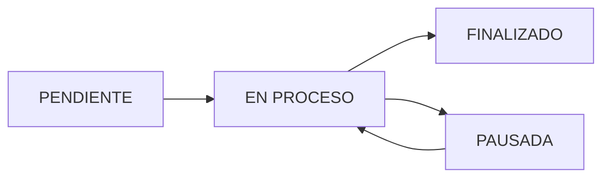

## Overview

The Order Management module (OT = Orden de Trabajo) is the core of P.FLEX production planning. It manages the complete lifecycle of work orders from initial import through production execution and completion.

<CardGroup cols={2}>
  <Card title="Dual Database System" icon="database">
    Separate internal database and active work list for efficient operations
  </Card>
  <Card title="Advanced Filtering" icon="filter">
    Multi-criteria search by status, machine, client, seller, and date
  </Card>
  <Card title="Excel Import/Export" icon="file-excel">
    Bulk data operations with automatic field mapping
  </Card>
  <Card title="Inline Editing" icon="pen-to-square">
    Edit status and plant entry dates directly in the table
  </Card>
</CardGroup>

---

## Work Order Data Model

The OT interface contains comprehensive production specifications:

```typescript
// Order Model (orders.models.ts:2-68)
export interface OT {
  // Core Identification
  OT: string;                    // Work order number (primary key)
  'Nro. Cotizacion': string;     // Quote number
  'Nro. Ficha': string;          // Product specification sheet
  Pedido: string;                // Sales order reference
  'ORDEN COMPRA': string;        // Customer purchase order
  
  // Client Information
  'Razon Social': string;        // Client name
  Vendedor: string;              // Sales representative
  
  // Product Specifications
  descripcion: string;           // Product description
  Material: string;              // Substrate material
  impresion: string;             // Print specification
  troquel: string;               // Die reference
  forma: string;                 // Shape/form
  adhesivo: string;              // Adhesive type
  acabado: string;               // Finishing requirements
  
  // Dimensions & Quantities
  Ancho: string;                 // Width
  'CANT PED': number | string;   // Ordered quantity
  Und: string;                   // Unit of measure
  total_mtl: string;             // Total meters
  mtl_sin_merma: string;         // Meters without waste
  s_merma: string;               // Waste allowance
  
  // Production
  maquina: string;               // Assigned machine
  codmaquina: string;            // Machine code
  Linea_produccion: string;      // Production line
  
  // Dates
  'FECHA PED': string;           // Order date
  'FECHA ENT': string;           // Delivery date
  'FECHA INGRESO PLANTA'?: string; // Plant entry date (NEW)
  fechaPrd: string;              // Production date
  
  // Status
  Estado_pedido: string;         // PENDIENTE | EN PROCESO | FINALIZADO | PAUSADA
}
```

<Note>
  The `FECHA INGRESO PLANTA` field was added to track when orders physically enter the production facility, enabling better WIP (Work In Progress) analysis.
</Note>

---

## Dual Database Architecture

P.FLEX uses a two-tier database system to optimize performance and workflow:

### Internal Database (Master Repository)

The internal database stores **all** imported OTs as a complete historical record.

```typescript
// Orders Service (orders.service.ts:6-22)
export class OrdersService {
  // Active OTs (Visible in List)
  private _ots = new BehaviorSubject<Partial<OT>[]>([]);

  // Internal Database (Hidden Source of Truth from Import)
  private _internalDatabase = new BehaviorSubject<Partial<OT>[]>([]);
  private _dbLastUpdated = new BehaviorSubject<Date | null>(null);

  get ots() { return this._ots.value; }
  get internalDatabase() { return this._internalDatabase.value; }
  get dbLastUpdated() { return this._dbLastUpdated.value; }
}
```

### Active Work List

The active list contains only the OTs currently being worked on in the plant.

<Tabs>
  <Tab title="Why Two Lists?">
    **Advantages:**
    - Reduced visual clutter: Operators only see relevant work orders
    - Performance: Smaller dataset for faster filtering/sorting
    - Historical tracking: All imports preserved in internal DB
    - Selective activation: Pull orders from DB only when needed
  </Tab>
  
  <Tab title="Workflow">
    <Steps>
      <Step title="Import Data">
        Excel import updates internal database (all records)
      </Step>
      <Step title="Search Database">
        Use "Buscar en BD" to browse available OTs
      </Step>
      <Step title="Activate Orders">
        Select OTs and add to active work list
      </Step>
      <Step title="Execute Production">
        Work with active list, update statuses
      </Step>
    </Steps>
  </Tab>
</Tabs>

---

## Database Search & Activation

Users can search the internal database and selectively activate orders.

### Search Modal

```typescript
// Database Selector UI (ot-list.component.ts:25-98)
<div *ngIf="showDbSelector" class="fixed inset-0 z-[60] flex items-center justify-center">
  <div class="glassmorphism-card rounded-2xl w-full max-w-4xl">
    <!-- Search Bar -->
    <div class="p-4 bg-white/5 border-b border-white/10">
      <input type="text" [(ngModel)]="dbSearchTerm" 
        placeholder="Buscar OT, Cliente o Producto en base de datos...">
    </div>
    
    <!-- Results Table -->
    <table class="w-full">
      <tbody>
        <tr *ngFor="let item of filteredDbItems" 
            (click)="toggleDbSelection(item)">
          <td>
            <div class="w-5 h-5 rounded border" 
              [ngClass]="isDbSelected(item) ? 'bg-primary' : 'border-slate-500'">
              <span *ngIf="isDbSelected(item)">check</span>
            </div>
          </td>
          <td>{{ item.OT }}</td>
          <td>{{ item['Razon Social'] }}</td>
          <td>{{ item.descripcion }}</td>
          <td>
            <span *ngIf="isAlreadyInList(item)">En Lista</span>
            <span *ngIf="!isAlreadyInList(item)">Disponible</span>
          </td>
        </tr>
      </tbody>
    </table>
    
    <button (click)="addSelectedToActiveList()">Agregar a Lista</button>
  </div>
</div>
```

### Activation Logic

```typescript
// Add Selected OTs to Active List (ot-list.component.ts:704-726)
addSelectedToActiveList() {
  const db = this.ordersService.internalDatabase;
  const selected = db.filter(i => this.dbSelectedItems.has(String(i.OT)));
  const current = this.ordersService.ots;
  
  // Strict check to prevent duplicates
  const newItems = selected
    .filter(s => !current.some(c => 
      String(c.OT).trim().toUpperCase() === String(s.OT).trim().toUpperCase()
    ))
    .map(s => ({
      ...s,
      Estado_pedido: 'PENDIENTE',
      'FECHA INGRESO PLANTA': s['FECHA INGRESO PLANTA'] || 
        new Date().toISOString().split('T')[0]
    }));
  
  if (newItems.length > 0) {
    this.ordersService.updateOts([...current, ...newItems]);
    this.audit.log(this.state.userName(), this.state.userRole(), 
      'OTS', 'Activar OTs', `Se activaron ${newItems.length} OTs desde BD.`);
    alert(`${newItems.length} OTs agregadas.`);
  }
}
```

<Warning>
  Duplicate checking is case-insensitive and trims whitespace to prevent accidental duplicates.
</Warning>

---

## Advanced Filtering

The OT list supports multi-dimensional filtering across 6 criteria:

### Filter Bar

```typescript
// Filter Controls (ot-list.component.ts:145-213)
<div class="grid grid-cols-12 gap-3">
  <!-- SEARCH (3 cols) -->
  <input [(ngModel)]="searchTerm" 
    (ngModelChange)="updateSearch($event)"
    placeholder="Buscar OT, producto..." />
  
  <!-- STATUS (2 cols) -->
  <select [(ngModel)]="statusFilter" (ngModelChange)="updateStatusFilter($event)">
    <option value="">Estado: Todos</option>
    <option value="PENDIENTE">Pendiente</option>
    <option value="EN PROCESO">En Proceso</option>
    <option value="FINALIZADO">Terminado</option>
    <option value="PAUSADA">Pausada</option>
  </select>
  
  <!-- MACHINE (2 cols) -->
  <select [(ngModel)]="machineFilter">
    <option value="">Máquina: Todas</option>
    <option *ngFor="let m of state.adminMachines()" [value]="m.name">
      {{ m.name }}
    </option>
  </select>
  
  <!-- CLIENT (2 cols) -->
  <select [(ngModel)]="clientFilter">
    <option value="">Cliente: Todos</option>
    <option *ngFor="let c of uniqueClients" [value]="c">{{ c }}</option>
  </select>
  
  <!-- SELLER (1 col) -->
  <select [(ngModel)]="sellerFilter">
    <option value="">Vend: Todos</option>
    <option *ngFor="let s of uniqueSellers" [value]="s">{{ s }}</option>
  </select>
  
  <!-- MONTH (1 col) -->
  <select [(ngModel)]="monthFilter">
    <option value="">Mes: Todos</option>
    <option *ngFor="let m of uniqueMonths" [value]="m">{{ m }}</option>
  </select>
  
  <!-- RESET (1 col) -->
  <button (click)="clearFilters()">
    <span class="material-icons">filter_alt_off</span>
  </button>
</div>
```

### Filter Logic

```typescript
// Filtering Implementation (ot-list.component.ts:453-483)
get filteredOts() {
  const term = this.searchTerm.toLowerCase().trim();
  const status = this.statusFilter;
  const machine = this.machineFilter;
  const client = this.clientFilter;
  const seller = this.sellerFilter;
  const month = this.monthFilter;

  return this.localOts.filter(ot => {
    const displayId = String(ot.OT || '').toLowerCase();
    const otClient = String(ot['Razon Social'] || '').toLowerCase();
    const desc = String(ot.descripcion || '').toLowerCase();
    const otStatus = String(ot.Estado_pedido || '').trim();
    const otMachine = String(ot.maquina || '').trim();
    const otSeller = String(ot.Vendedor || '').trim();
    const otDate = this.toInputDate(ot['FECHA ENT']);

    const matchesSearch = term === '' || 
      displayId.includes(term) || 
      otClient.includes(term) ||
      desc.includes(term);
    const matchesStatus = status === '' || otStatus === status;
    const matchesMachine = machine === '' || otMachine === machine;
    const matchesClient = client === '' || ot['Razon Social'] === client;
    const matchesSeller = seller === '' || ot.Vendedor === seller;
    const matchesMonth = month === '' || (otDate && otDate.startsWith(month));

    return matchesSearch && matchesStatus && matchesMachine && 
      matchesClient && matchesSeller && matchesMonth;
  });
}
```

<Info>
  Filter dropdown options are dynamically generated from actual data in the list (unique values).
</Info>

---

## Inline Editing

Critical fields can be edited directly in the table without opening a modal.

### Status Dropdown

```typescript
// Inline Status Editor (ot-list.component.ts:244-264)
<td class="p-4">
  <div (click)="$event.stopPropagation()">
    <select [ngModel]="ot.Estado_pedido"
      (ngModelChange)="updateOtField(ot, 'Estado_pedido', $event)"
      class="appearance-none cursor-pointer px-3 py-1.5 rounded-lg"
      [ngClass]="{
        'bg-primary/20 text-blue-100': ot.Estado_pedido === 'EN PROCESO',
        'bg-white/5 text-slate-300': ot.Estado_pedido === 'PENDIENTE',
        'bg-emerald-500/20 text-emerald-100': ot.Estado_pedido === 'FINALIZADO',
        'bg-yellow-500/20 text-yellow-100': ot.Estado_pedido === 'PAUSADA'
      }">
      <option value="PENDIENTE">PENDIENTE</option>
      <option value="EN PROCESO">EN PROCESO</option>
      <option value="FINALIZADO">FINALIZADO</option>
      <option value="PAUSADA">PAUSADA</option>
    </select>
  </div>
</td>
```

### Plant Entry Date Picker

```typescript
// Inline Date Picker (ot-list.component.ts:294-302)
<td class="p-4">
  <div (click)="$event.stopPropagation()">
    <span class="material-icons">input</span>
    <input type="date" 
      [ngModel]="toInputDate(ot['FECHA INGRESO PLANTA'])"
      (ngModelChange)="updateOtField(ot, 'FECHA INGRESO PLANTA', $event)"
      class="bg-transparent border-none text-xs" />
  </div>
</td>
```

### Update Handler

```typescript
// Field Update Logic (ot-list.component.ts:583-597)
updateOtField(ot: OT, field: keyof OT, value: any) {
  const oldVal = (ot as any)[field];
  (ot as any)[field] = value;
  
  const allOts = this.ordersService.ots;
  const index = allOts.findIndex(o => o.OT === ot.OT);
  
  if (index !== -1) {
    const updatedList = [...allOts];
    updatedList[index] = { ...updatedList[index], [field]: value };
    this.ordersService.updateOts(updatedList);
    
    if (field === 'Estado_pedido') {
      this.audit.log(this.state.userName(), this.state.userRole(), 
        'OTS', 'Cambio Estado', `OT ${ot.OT} cambió de ${oldVal} a ${value}`);
    }
  }
}
```

---

## Excel Import Workflow

The import process uses optimized Map-based lookups for O(1) performance.

### Import Process

<Steps>
  <Step title="File Selection">
    User clicks "Actualizar BD" and selects Excel/CSV file.
  </Step>
  
  <Step title="Data Parsing">
    File is read and converted to JSON array with automatic column mapping.
  </Step>
  
  <Step title="Deduplication">
    System checks both internal database and active list for existing OTs.
  </Step>
  
  <Step title="Update Strategy">
    - Existing DB records: Merge new data
    - New DB records: Insert with full data
    - Active list: Update if present, preserving status
  </Step>
  
  <Step title="Confirmation">
    Display summary: "Nuevos: X, Actualizados: Y, Lista Activa: Z"
  </Step>
</Steps>

### Optimized Import Implementation

```typescript
// High-Performance Import (ot-list.component.ts:629-682)
handleImport(data: any[]) {
  // Create Maps for O(1) lookup performance
  const dbMap = new Map(
    this.ordersService.internalDatabase.map(item => 
      [String(item.OT).trim().toUpperCase(), item]
    )
  );
  
  const activeOts = [...this.ordersService.ots];
  const activeMap = new Map(
    activeOts.map((item, index) => 
      [String(item.OT).trim().toUpperCase(), index]
    )
  );

  let addedCount = 0;
  let updatedCount = 0;
  let activeUpdatedCount = 0;

  data.forEach((item: any) => {
    if (!item.OT) return;
    const otId = String(item.OT).trim().toUpperCase();

    // 1. Internal DB Update
    if (dbMap.has(otId)) {
      const existing = dbMap.get(otId)!;
      dbMap.set(otId, { ...existing, ...item });
      updatedCount++;
    } else {
      dbMap.set(otId, item);
      addedCount++;
    }

    // 2. Active List Update (Sync imported changes)
    if (activeMap.has(otId)) {
      const idx = activeMap.get(otId)!;
      const currentActive = activeOts[idx];
      const currentStatus = currentActive.Estado_pedido;
      
      activeOts[idx] = { ...currentActive, ...item };
      
      // Preserve existing status if import doesn't specify
      if (!item.Estado_pedido && currentStatus) {
        activeOts[idx].Estado_pedido = currentStatus;
      }
      activeUpdatedCount++;
    }
  });

  // Update Stores
  this.ordersService.updateInternalDatabase(Array.from(dbMap.values()));
  if (activeUpdatedCount > 0) {
    this.ordersService.updateOts(activeOts);
  }

  alert(`Proceso completado.\n\nBase de Datos:\n- Nuevos: ${addedCount}\n- Actualizados: ${updatedCount}\n\nLista Activa:\n- Actualizados: ${activeUpdatedCount}`);
}
```

<Note>
  Using JavaScript `Map` instead of `Array.find()` reduces time complexity from O(n²) to O(n) for large imports.
</Note>

---

## Pagination

Large datasets are paginated for performance and usability.

```typescript
// Pagination Logic (ot-list.component.ts:485-493)
get paginatedOts() {
  const start = (this.currentPage - 1) * this.pageSize;
  const end = start + this.pageSize;
  return this.filteredOts.slice(start, end);
}

get totalPages() { 
  return Math.ceil(this.filteredOts.length / this.pageSize) || 1; 
}

get showingStart() { 
  return this.filteredOts.length === 0 ? 0 : (this.currentPage - 1) * this.pageSize + 1; 
}

get showingEnd() { 
  return Math.min(this.currentPage * this.pageSize, this.filteredOts.length); 
}
```

---

## OT Detail View

Clicking any row opens a comprehensive detail modal with full specifications.

```typescript
// Detail Modal Trigger (ot-list.component.ts:577-578)
openDetail(ot: OT) { 
  this.selectedOt = ot; 
}
```

<CardGroup cols={2}>
  <Card title="Product Specs" icon="file-lines">
    Material, dimensions, colors, die/tooling references
  </Card>
  <Card title="Production Data" icon="gears">
    Machine, meters, quantities, waste calculations
  </Card>
  <Card title="Timeline" icon="clock">
    Order date, entry date, delivery date, production date
  </Card>
  <Card title="Client Info" icon="building">
    Customer, sales rep, purchase order, quote number
  </Card>
</CardGroup>

---

## Status Workflow

OTs follow a standard lifecycle:



<AccordionGroup>
  <Accordion title="PENDIENTE" icon="clock">
    Initial status for all new/imported orders. Awaiting material availability and scheduling.
  </Accordion>
  
  <Accordion title="EN PROCESO" icon="play">
    Active production. Appears in dashboard feed and production tracking modules.
  </Accordion>
  
  <Accordion title="PAUSADA" icon="pause">
    Temporarily halted due to tooling issues, material shortage, or machine downtime.
  </Accordion>
  
  <Accordion title="FINALIZADO" icon="check">
    Completed production. Moves to finished goods inventory.
  </Accordion>
</AccordionGroup>

---

## Related Modules

<CardGroup cols={2}>
  <Card title="Production Tracking" icon="chart-line" href="/features/production">
    Monitor active OTs in real-time with production reports
  </Card>
  <Card title="Planning & Scheduling" icon="calendar" href="/features/planning">
    Assign OTs to machines and schedule production runs
  </Card>
  <Card title="Inventory Management" icon="box" href="/features/inventory">
    Track tooling (clisés/dies) required for each OT
  </Card>
  <Card title="Dashboard" icon="gauge" href="/features/dashboard">
    View active OTs in the operations feed
  </Card>
</CardGroup>