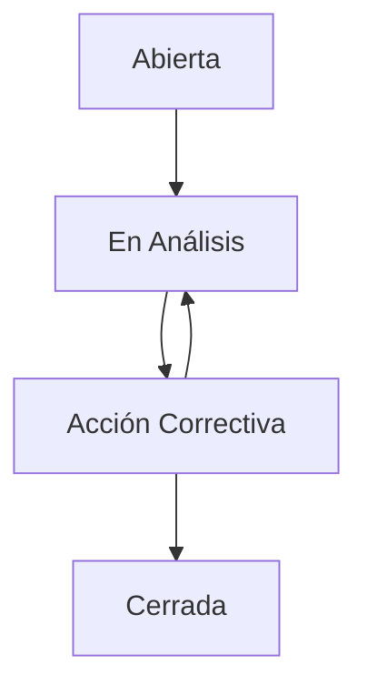

## Overview

The Quality Control module manages non-conformances, incidents, and the complete CAPA (Corrective and Preventive Actions) lifecycle. It provides structured workflows for identifying root causes, implementing corrective measures, and preventing recurrence.

<CardGroup cols={2}>
  <Card title="Incident Tracking" icon="triangle-exclamation">
    Real-time monitoring of quality, safety, and machinery incidents
  </Card>
  <Card title="CAPA Workflow" icon="list-check">
    Structured action planning with responsibility assignment and deadlines
  </Card>
  <Card title="Root Cause Analysis" icon="magnifying-glass-chart">
    Mandatory root cause documentation before incident closure
  </Card>
  <Card title="Priority System" icon="flag">
    Three-tier priority classification (Alta/Media/Baja) with visual indicators
  </Card>
</CardGroup>

---

## Incident Data Model

Incidents are comprehensively tracked from creation through resolution:

```typescript
// Incident Interface (quality.models.ts:2-31)
export type IncidentPriority = 'Alta' | 'Media' | 'Baja';
export type IncidentType = 'Calidad' | 'Seguridad' | 'Maquinaria' | 'Material' | 'Otro';
export type IncidentStatus = 'Abierta' | 'En Análisis' | 'Acción Correctiva' | 'Cerrada';

export interface Incident {
  id: string;
  code: string;              // Auto-generated code (e.g., "INC-2024-001")
  title: string;             // Brief incident description
  description: string;       // Detailed description
  
  // Classification
  priority: IncidentPriority; // Alta, Media, Baja
  type: IncidentType;        // Category
  status: IncidentStatus;    // Workflow state
  
  // References
  otRef?: string;            // Related work order (optional)
  machineRef?: string;       // Affected machine (optional)
  
  // People
  reportedBy: string;        // Person who reported
  assignedTo: string;        // Responsible area/person
  
  // Timeline
  reportedAt: Date;          // Timestamp of report
  
  // Resolution
  rootCause?: string;        // Root cause analysis (required for closure)
  actions: CapaAction[];     // Corrective/Preventive actions
}
```

---

## CAPA Action Model

Corrective and Preventive Actions (CAPA) are tracked individually:

```typescript
// CAPA Action Interface (quality.models.ts:6-13)
export interface CapaAction {
  id: string;
  description: string;       // What needs to be done
  type: 'Correctiva' | 'Preventiva';
  responsible: string;       // Person assigned
  deadline: string;          // Target completion date
  completed: boolean;        // Completion status
}
```

<Tabs>
  <Tab title="Corrective Actions">
    **Correctiva (Corrective)** actions address the immediate problem.
    
    **Purpose:** Fix the current issue and prevent it from continuing.
    
    **Examples:**
    - Replace worn die
    - Adjust machine settings
    - Retrain operator
    - Quarantine defective batch
    
    **Timeline:** Immediate to short-term (hours to days)
  </Tab>
  
  <Tab title="Preventive Actions">
    **Preventiva (Preventive)** actions address the root cause to prevent recurrence.
    
    **Purpose:** Modify processes or systems to eliminate the problem permanently.
    
    **Examples:**
    - Update maintenance schedule
    - Revise work instructions
    - Install quality sensors
    - Change supplier specifications
    
    **Timeline:** Medium to long-term (weeks to months)
  </Tab>
</Tabs>

---

## Incident Priority System

Three-tier priority classification determines response urgency:

### Priority Levels

<AccordionGroup>
  <Accordion title="Alta (High)" icon="circle-exclamation">
    **Definition:** Critical issues requiring immediate action.
    
    **Criteria:**
    - Production stoppage
    - Safety hazard
    - Customer complaint (major)
    - Regulatory non-compliance
    - Product recall risk
    
    **Response Time:** < 2 hours
    
    **Visual:** Red badge, pulsing animation, top of dashboard
  </Accordion>
  
  <Accordion title="Media (Medium)" icon="triangle-exclamation">
    **Definition:** Significant issues that impact quality or efficiency.
    
    **Criteria:**
    - Quality deviation (within spec)
    - Minor machine malfunction
    - Material defect (reworkable)
    - Process inefficiency
    
    **Response Time:** < 24 hours
    
    **Visual:** Yellow badge
  </Accordion>
  
  <Accordion title="Baja (Low)" icon="circle-info">
    **Definition:** Minor issues or improvement opportunities.
    
    **Criteria:**
    - Cosmetic defects
    - Documentation errors
    - Housekeeping issues
    - Continuous improvement suggestions
    
    **Response Time:** < 1 week
    
    **Visual:** Green badge
  </Accordion>
</AccordionGroup>

### Priority-Based Styling

```typescript
// Priority Color Coding (incidents.component.ts:55-60)
<div class="absolute left-0 top-0 bottom-0 w-1"
  [ngClass]="{
    'bg-red-500 shadow-[0_0_10px_rgba(239,68,68,0.5)]': incident.priority === 'Alta',
    'bg-yellow-500 shadow-[0_0_10px_rgba(234,179,8,0.5)]': incident.priority === 'Media',
    'bg-emerald-500 shadow-[0_0_10px_rgba(16,185,129,0.5)]': incident.priority === 'Baja'
  }">
</div>
```

---

## Incident Lifecycle

Incidents follow a structured workflow from creation to closure:



<Steps>
  <Step title="Abierta (Open)">
    Initial report submitted with priority and assignment.
    
    **Activities:**
    - Incident documented
    - Priority assessed
    - Area assigned
    - OT/Machine linked (if applicable)
  </Step>
  
  <Step title="En Análisis (Under Analysis)">
    Investigation phase to identify root cause.
    
    **Activities:**
    - Data collection
    - Process review
    - Stakeholder interviews
    - Root cause documentation
  </Step>
  
  <Step title="Acción Correctiva (Corrective Action)">
    CAPA actions defined and executed.
    
    **Activities:**
    - Corrective actions implemented
    - Preventive measures designed
    - Effectiveness verified
    - Documentation updated
  </Step>
  
  <Step title="Cerrada (Closed)">
    Incident resolved with root cause and actions completed.
    
    **Requirements:**
    - Root cause documented
    - All critical actions completed
    - Effectiveness verified
    - Approval obtained
  </Step>
</Steps>

---

## Creating New Incidents

Users can report incidents from the dashboard or dedicated incidents page:

### Incident Creation Form

```typescript
// Create Modal (incidents.component.ts:123-189)
<div *ngIf="showCreateModal" class="fixed inset-0 z-[60]">
  <div class="glassmorphism-card rounded-2xl w-full max-w-lg">
    <div class="px-6 py-4 border-b">
      <h2 class="text-lg font-bold text-white flex items-center gap-2">
        <span class="material-icons text-red-500">add_circle</span> 
        Nueva Incidencia
      </h2>
    </div>
    
    <div class="p-6 space-y-5">
      <!-- Title -->
      <div>
        <label class="block text-xs font-bold text-slate-400 mb-2 uppercase">
          Título Corto *
        </label>
        <input type="text" [(ngModel)]="newIncidentData.title" 
          class="w-full rounded-xl px-4 py-3 text-sm text-white" />
      </div>
      
      <!-- Type & Priority -->
      <div class="grid grid-cols-2 gap-4">
        <div>
          <label class="block text-xs font-bold text-slate-400 mb-2 uppercase">
            Tipo *
          </label>
          <select [(ngModel)]="newIncidentData.type" 
            class="w-full rounded-xl px-3 py-3 text-sm text-white">
            <option value="Maquinaria">Maquinaria</option>
            <option value="Calidad">Calidad</option>
            <option value="Seguridad">Seguridad</option>
            <option value="Material">Material</option>
            <option value="Otro">Otro</option>
          </select>
        </div>
        
        <div>
          <label class="block text-xs font-bold text-slate-400 mb-2 uppercase">
            Prioridad *
          </label>
          <select [(ngModel)]="newIncidentData.priority" 
            class="w-full rounded-xl px-3 py-3 text-sm text-white">
            <option value="Alta">Alta (Crítica)</option>
            <option value="Media">Media</option>
            <option value="Baja">Baja</option>
          </select>
        </div>
      </div>
      
      <!-- Description -->
      <div>
        <label class="block text-xs font-bold text-slate-400 mb-2 uppercase">
          Descripción Detallada *
        </label>
        <textarea [(ngModel)]="newIncidentData.description" rows="3" 
          class="w-full rounded-xl px-4 py-3 text-sm text-white resize-none">
        </textarea>
      </div>
      
      <!-- Optional References -->
      <div class="grid grid-cols-2 gap-4">
        <div>
          <label class="block text-xs font-bold text-slate-400 mb-2 uppercase">
            OT (Opcional)
          </label>
          <input type="text" [(ngModel)]="newIncidentData.otRef" 
            placeholder="Ej. 45200" class="w-full rounded-xl px-4 py-3" />
        </div>
        
        <div>
          <label class="block text-xs font-bold text-slate-400 mb-2 uppercase">
            Asignar a
          </label>
          <select [(ngModel)]="newIncidentData.assignedTo" 
            class="w-full rounded-xl px-3 py-3">
            <option value="Mantenimiento">Mantenimiento</option>
            <option value="Calidad">Calidad</option>
            <option value="Producción">Producción</option>
            <option value="Almacén">Almacén</option>
            <option value="Seguridad">Seguridad</option>
          </select>
        </div>
      </div>
    </div>
    
    <div class="p-6 border-t flex justify-end gap-3">
      <button (click)="showCreateModal = false">
        Cancelar
      </button>
      <button (click)="createIncident()" 
        class="px-6 py-2.5 bg-red-600 hover:bg-red-500 text-white font-bold rounded-xl">
        <span class="material-icons text-sm">send</span> Reportar
      </button>
    </div>
  </div>
</div>
```

### Creation Handler

```typescript
// Create Incident Logic (incidents.component.ts:390-397)
createIncident() {
  if (!this.newIncidentData.title || !this.newIncidentData.description) {
    alert('Complete el título y la descripción.');
    return;
  }
  
  this.service.addIncident(this.newIncidentData);
  this.showCreateModal = false;
}
```

---

## Incident Detail View

Clicking an incident card opens a comprehensive detail modal with CAPA management:

### Two-Panel Layout

<CardGroup cols={2}>
  <Card title="Left Panel: Incident Info" icon="info-circle">
    - Full description
    - Reporter and date
    - Assigned area
    - Current status
    - Root cause analysis field
  </Card>
  
  <Card title="Right Panel: CAPA Actions" icon="tasks">
    - List of all actions
    - Action type (Correctiva/Preventiva)
    - Responsible person
    - Deadline dates
    - Completion checkboxes
  </Card>
</CardGroup>

### Root Cause Analysis Section

For open incidents, users can document root cause analysis:

```typescript
// Root Cause Editor (incidents.component.ts:239-247)
<div *ngIf="selectedIncident.status !== 'Cerrada'" class="pt-4 border-t">
  <h3 class="text-xs font-bold text-slate-500 uppercase mb-2">
    Análisis de Causa Raíz
  </h3>
  <textarea 
    [ngModel]="selectedIncident.rootCause" 
    (ngModelChange)="selectedIncident.rootCause = $event"
    (blur)="service.updateIncident(selectedIncident)"
    placeholder="Describa la causa raíz..."
    class="w-full text-sm rounded-xl p-3 outline-none min-h-[80px]">
  </textarea>
</div>
```

<Warning>
  Root cause analysis is **mandatory** before incident closure. The system validates this requirement.
</Warning>

---

## CAPA Action Management

### Adding Actions

Users can add both corrective and preventive actions to incidents:

```typescript
// Add Action Form (incidents.component.ts:262-289)
<div *ngIf="showAddAction" class="bg-blue-500/10 p-4 rounded-xl border">
  <h4 class="text-xs font-bold text-blue-300 uppercase mb-3">Nueva Acción</h4>
  
  <div class="grid grid-cols-2 gap-3 mb-3">
    <div>
      <label class="block text-[10px] font-bold text-slate-400 mb-1">Tipo</label>
      <select [(ngModel)]="newActionData.type" 
        class="w-full text-sm bg-black/30 border text-white rounded-lg p-2">
        <option value="Correctiva">Correctiva (Inmediata)</option>
        <option value="Preventiva">Preventiva (Largo Plazo)</option>
      </select>
    </div>
    
    <div>
      <label class="block text-[10px] font-bold text-slate-400 mb-1">
        Responsable
      </label>
      <input type="text" [(ngModel)]="newActionData.responsible" 
        class="w-full text-sm bg-black/30 border text-white rounded-lg p-2" />
    </div>
    
    <div class="col-span-2">
      <label class="block text-[10px] font-bold text-slate-400 mb-1">
        Descripción
      </label>
      <input type="text" [(ngModel)]="newActionData.description" 
        class="w-full text-sm bg-black/30 border text-white rounded-lg p-2" />
    </div>
    
    <div>
      <label class="block text-[10px] font-bold text-slate-400 mb-1">
        Fecha Límite
      </label>
      <input type="date" [(ngModel)]="newActionData.deadline" 
        class="w-full text-sm bg-black/30 border text-white rounded-lg p-2" />
    </div>
  </div>
  
  <div class="flex justify-end gap-2">
    <button (click)="showAddAction = false" 
      class="text-xs font-bold text-slate-400 hover:text-white px-3 py-1">
      Cancelar
    </button>
    <button (click)="saveAction(selectedIncident.id)" 
      class="text-xs font-bold bg-blue-600 text-white px-3 py-1 rounded-lg">
      Guardar
    </button>
  </div>
</div>
```

### Action List Display

```typescript
// Actions List (incidents.component.ts:292-320)
<div class="space-y-3">
  <ng-container *ngFor="let action of selectedIncident.actions; trackBy: trackById">
    <div class="border rounded-xl p-3 flex gap-3 items-start group" 
      [ngClass]="action.completed ? 
        'bg-white/5 border-white/5 opacity-60' : 
        'bg-white/5 border-white/10 hover:bg-white/10'">
      
      <!-- Completion Checkbox -->
      <button (click)="toggleAction(selectedIncident.id, action.id)" 
        [disabled]="selectedIncident.status === 'Cerrada'"
        class="mt-0.5 w-5 h-5 rounded border flex items-center justify-center"
        [ngClass]="action.completed ? 
          'bg-emerald-500 border-emerald-500 text-black' : 
          'bg-transparent border-slate-500 hover:border-emerald-400'">
        <span class="material-icons text-sm font-bold">check</span>
      </button>

      <div class="flex-1">
        <div class="flex justify-between items-start">
          <p class="text-sm font-bold text-slate-200" 
            [class.line-through]="action.completed">
            {{ action.description }}
          </p>
          <span class="text-[10px] px-2 py-0.5 rounded font-bold uppercase"
            [ngClass]="action.type === 'Correctiva' ? 
              'bg-orange-500/20 text-orange-400' : 
              'bg-blue-500/20 text-blue-400'">
            {{ action.type }}
          </span>
        </div>
        
        <div class="flex gap-4 mt-2 text-xs text-slate-500">
          <span>
            <strong class="text-slate-400">Resp:</strong> 
            {{ action.responsible }}
          </span>
          <span [class.text-red-400]="isOverdue(action.deadline) && !action.completed">
            <strong class="text-slate-400">Límite:</strong> 
            {{ action.deadline | date:'dd/MM/yy' }}
          </span>
        </div>
      </div>
    </div>
  </ng-container>
</div>
```

### Toggle Completion

```typescript
// Toggle Action Status (incidents.component.ts:426-433)
toggleAction(incidentId: string, actionId: string) {
  this.service.toggleActionCompletion(incidentId, actionId);
  
  // Update local view
  if (this.selectedIncident) {
    const updated = this.service.incidents.find(i => i.id === incidentId);
    if (updated) this.selectedIncident = JSON.parse(JSON.stringify(updated));
  }
}
```

---

## Incident Closure

Incidents can only be closed when specific requirements are met:

### Closure Validation

```typescript
// Resolve Incident (incidents.component.ts:435-450)
resolveIncident(incidentId: string) {
  const incident = this.service.incidents.find(i => i.id === incidentId);
  const pendingActions = incident?.actions.some(a => !a.completed);

  // Warn about pending actions
  if (pendingActions) {
    if (!confirm('Hay acciones pendientes. ¿Desea cerrar la incidencia de todos modos?')) {
      return;
    }
  }

  // Require root cause
  if (!incident?.rootCause) {
    alert('Debe ingresar un Análisis de Causa Raíz antes de cerrar.');
    return;
  }

  this.service.closeIncident(incidentId);
  this.closeDetailModal();
}
```

<Steps>
  <Step title="Validation Check">
    System verifies:
    - Root cause analysis is documented
    - Critical actions are completed (or acknowledged override)
  </Step>
  
  <Step title="Closure Confirmation">
    User confirms closure intent, especially if actions remain pending
  </Step>
  
  <Step title="Status Update">
    Incident status changes to "Cerrada" and becomes read-only
  </Step>
  
  <Step title="Archive">
    Closed incidents move to the "Cerradas" tab for historical reference
  </Step>
</Steps>

---

## Filtering: Active vs Closed

Incidents are organized into two views:

```typescript
// Filter Tabs (incidents.component.ts:36-47)
<div class="flex gap-2 mb-6 border-b border-white/10 pb-1">
  <button (click)="activeFilter = 'active'" 
    [class]="activeFilter === 'active' ? 
      'bg-white/10 text-white border-b-2 border-primary' : 
      'text-slate-400 hover:text-white hover:bg-white/5'">
    Activas ({{ service.activeIncidents.length }})
  </button>
  
  <button (click)="activeFilter = 'closed'" 
    [class]="activeFilter === 'closed' ? 
      'bg-white/10 text-white border-b-2 border-slate-400' : 
      'text-slate-400 hover:text-white hover:bg-white/5'">
    Cerradas ({{ service.closedIncidents.length }})
  </button>
</div>

// Filter Logic (incidents.component.ts:357-359)
get filteredIncidents() {
  return this.activeFilter === 'active' ? 
    this.service.activeIncidents : 
    this.service.closedIncidents;
}
```

---

## Icon Mapping by Type

Each incident type has a distinct icon for quick visual identification:

```typescript
// Type Icons (incidents.component.ts:453-461)
getIconByType(type: IncidentType): string {
  switch(type) {
    case 'Maquinaria': return 'settings';
    case 'Calidad': return 'search';
    case 'Seguridad': return 'health_and_safety';
    case 'Material': return 'inventory_2';
    default: return 'info';
  }
}
```

<CardGroup cols={3}>
  <Card title="Maquinaria" icon="gears">
    Machine breakdowns, malfunctions, or performance issues
  </Card>
  <Card title="Calidad" icon="magnifying-glass">
    Product defects, specification deviations, or quality failures
  </Card>
  <Card title="Seguridad" icon="shield">
    Safety hazards, near-misses, or injury incidents
  </Card>
  <Card title="Material" icon="box">
    Raw material defects, supplier issues, or inventory problems
  </Card>
  <Card title="Otro" icon="circle-info">
    Miscellaneous issues not fitting other categories
  </Card>
</CardGroup>

---

## Dashboard Integration

Active high-priority incidents are prominently displayed on the main dashboard:

```typescript
// Dashboard Incident Counter (dashboard.component.ts:595-601)
get activeIncidentsCount() {
  return this.qualityService.activeIncidents.length;
}

get highPriorityCount() {
  return this.qualityService.activeIncidents
    .filter(i => i.priority === 'Alta').length;
}
```

### Dashboard KPI Card

```typescript
// Incident KPI (dashboard.component.ts:156-174)
<div class="glassmorphism-card p-4 rounded-2xl hover:bg-red-500/10 cursor-pointer" 
  (click)="router.navigate(['/incidents'])">
  <div class="flex justify-between items-start text-slate-500 mb-2">
    <span class="text-[10px] font-bold uppercase tracking-widest">
      Incidencias
    </span>
    <span class="material-symbols-outlined text-sm text-red-500 animate-pulse">
      report
    </span>
  </div>
  <div class="flex items-end justify-between">
    <div>
      <span class="text-2xl font-bold text-red-500 tracking-tight">
        {{ activeIncidentsCount | number:'2.0-0' }}
      </span>
      <div class="text-[10px] text-red-400/80 font-medium mt-0.5">
        {{ highPriorityCount }} Prioridad Alta
      </div>
    </div>
  </div>
</div>
```

---

## Overdue Action Detection

The system visually flags actions past their deadline:

```typescript
// Overdue Helper (incidents.component.ts:463-465)
isOverdue(dateStr: string): boolean {
  return new Date(dateStr) < new Date();
}

// Conditional Styling (incidents.component.ts:315)
<span [class.text-red-400]="isOverdue(action.deadline) && !action.completed">
  <strong>Límite:</strong> {{ action.deadline | date:'dd/MM/yy' }}
</span>
```

<Warning>
  Overdue actions appear in red text and should be prioritized or their deadlines extended with justification.
</Warning>

---

## Best Practices

<CardGroup cols={2}>
  <Card title="Timely Reporting" icon="clock">
    Report incidents immediately to enable swift corrective action
  </Card>
  
  <Card title="Detailed Descriptions" icon="align-left">
    Provide comprehensive details: what, when, where, how, and potential impact
  </Card>
  
  <Card title="Proper Classification" icon="tags">
    Assign accurate priority and type for appropriate routing and response
  </Card>
  
  <Card title="Root Cause Focus" icon="bullseye">
    Investigate thoroughly to identify true root cause, not just symptoms
  </Card>
  
  <Card title="SMART Actions" icon="target">
    Make actions Specific, Measurable, Achievable, Relevant, and Time-bound
  </Card>
  
  <Card title="Follow Through" icon="check-double">
    Track actions to completion and verify effectiveness
  </Card>
</CardGroup>

---

## Related Modules

<CardGroup cols={2}>
  <Card title="Dashboard" icon="gauge" href="/features/dashboard">
    Monitor active incidents and high-priority alerts
  </Card>
  <Card title="Production Tracking" icon="industry" href="/features/production">
    Production reports reference quality incidents
  </Card>
  <Card title="Order Management" icon="clipboard-list" href="/features/orders">
    Link incidents to specific work orders
  </Card>
  <Card title="Inventory" icon="warehouse" href="/features/inventory">
    Material and tooling defects trigger incidents
  </Card>
</CardGroup>