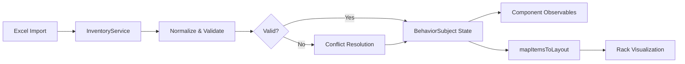

## Introduction

The P.FLEX Inventory Management module provides complete lifecycle tracking and warehouse organization for manufacturing assets and finished products:

<CardGroup cols={3}>
  <Card title="Clisés (Clichés)" icon="grid-2-plus" color="#3B82F6">
    Flexographic printing plates with usage metrics and maintenance tracking
  </Card>
  <Card title="Dies (Troqueles)" icon="scissors" color="#8B5CF6">
    Cutting dies and tooling with compatibility management
  </Card>
  <Card title="Finished Goods" icon="box-check" color="#10B981">
    Quality-released product ready for dispatch
  </Card>
</CardGroup>

## Architecture

Inventory data flows through Angular services with RxJS state management:

```typescript
// inventory.service.ts - Core service
export class InventoryService {
  private _cliseItems = new BehaviorSubject<CliseItem[]>([]);
  private _dieItems = new BehaviorSubject<DieItem[]>([]);
  private _stockItems = new BehaviorSubject<StockItem[]>([]);
  private _layoutData = new BehaviorSubject<RackConfig[]>([]);

  get cliseItems$() { return this._cliseItems.asObservable(); }
  get dieItems$() { return this._dieItems.asObservable(); }
  get stockItems$() { return this._stockItems.asObservable(); }
  get layoutData$() { return this._layoutData.asObservable(); }
}
```

Reference: `~/workspace/source/src/features/inventory/services/inventory.service.ts:9-233`

## Key Features

<AccordionGroup>
  <Accordion title="Physical Location Tracking" icon="map-location-dot">
    Every item is mapped to physical warehouse racks using numeric range-based positioning:
    
    - **Clisé Racks**: CL-1 through CL-4 (ranges 861-2180)
    - **Die Racks**: TRQ-1 through TRQ-2 (ranges 1-200)
    - **Finished Goods**: Dispatch zones (DES-A, DES-B)
    
    Visual rack layout mapping automatically updates as items are imported or relocated.
  </Accordion>

  <Accordion title="History & Audit Trail" icon="clock-rotate-left">
    All inventory items maintain complete operation history:
    
    ```typescript
    export interface CliseHistory {
      date: string;
      type: 'Producción' | 'Mantenimiento' | 'Reparación' | 
            'Cambio Versión' | 'Creación' | 'Baja' | 'Otro';
      description: string;
      user: string;
      machine?: string;
      amount?: number;
    }
    ```
    
    Reference: `~/workspace/source/src/features/inventory/models/inventory.models.ts:2-9`
  </Accordion>

  <Accordion title="Excel Import with Conflict Detection" icon="file-import">
    Smart column mapping handles varied spreadsheet formats:
    
    - **Flexible column names**: Maps "ubicación", "ubicacion", "location" → same field
    - **Validation**: Flags missing required fields (código, cliente)
    - **Preview modal**: Review before committing changes
    - **Conflict resolution**: Manual review of incomplete records
    
    Column mappings defined in `inventory.service.ts:183-218`
  </Accordion>

  <Accordion title="Cross-Reference Linking" icon="link">
    Dies and clisés can be explicitly linked for production planning:
    
    - Search and attach compatible dies to clisés
    - Auto-suggest based on Z-value (gear teeth) matching
    - Bidirectional references via `linkedDies` and `linkedClises` arrays
    - Visual compatibility indicators in detail modals
  </Accordion>
</AccordionGroup>

## Components

Each inventory type has dedicated Angular components:

| Component | Route | Purpose |
|-----------|-------|----------|
| `InventoryCliseComponent` | `/inventory/clise` | Cliché management |
| `InventoryDieComponent` | `/inventory/die` | Die/tooling management |
| `InventoryStockComponent` | `/inventory/stock` | Finished goods control |
| `InventoryMapComponent` | `/inventory/map` | Warehouse visualization |

<Note>
  All components are **standalone** and use the `InventoryService` for state management via observables.
</Note>

## Data Flow



## Best Practices

<Steps>
  <Step title="Use Structured Locations">
    Follow naming conventions: `CL-1-A-01` (Rack-Level-Zone-Position)
  </Step>
  
  <Step title="Maintain History Records">
    Log all operations (production runs, maintenance, repairs) in the `history` array
  </Step>
  
  <Step title="Regular Usage Updates">
    Update `mtl_acum` (accumulated meters) after production to trigger maintenance alerts
  </Step>
  
  <Step title="Link Compatible Tooling">
    Cross-reference dies with clisés to enable production planning
  </Step>
</Steps>

## Status Indicators

Inventory items display real-time status:

<ResponseField name="OK" type="status">
  Item is production-ready with no issues
</ResponseField>

<ResponseField name="MANT." type="status">
  Maintenance required (e.g., clisé exceeds 500,000 meters usage)
</ResponseField>

<ResponseField name="REVISAR" type="status">
  Data conflict or validation issue requiring manual review
</ResponseField>

<ResponseField name="Desgaste" type="status">
  Die showing wear, may need replacement soon
</ResponseField>

<ResponseField name="Dañado" type="status">
  Item damaged and unavailable for production
</ResponseField>

## Next Steps

<CardGroup cols={2}>
  <Card title="Cliché Management" icon="print" href="./clise-management">
    Learn about printing plate inventory
  </Card>
  <Card title="Die Management" icon="scissors" href="./die-management">
    Manage cutting tools and troqueles
  </Card>
  <Card title="Stock Control" icon="warehouse" href="./stock-control">
    Track finished goods inventory
  </Card>
  <Card title="Rack Layout" icon="map" href="./rack-layout">
    Visualize warehouse organization
  </Card>
</CardGroup>
