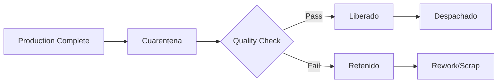

## Overview

The Stock Control module manages finished goods (producto terminado) after production completion, tracking items through quality inspection, quarantine, and final dispatch.

<Frame>
  
</Frame>

## StockItem Data Model

Complete interface from `inventory.models.ts:74-88`:

<Expandable title="StockItem Interface (TypeScript)">
  ```typescript
  export interface StockItem {
    id: string;
    ot: string;                  // Orden de Trabajo reference
    client: string;              // Customer name
    product: string;             // Product description
    quantity: number;            // Legacy/Total quantity
    unit: string;                // Legacy unit (Rollos, Cajas, etc.)
    rolls?: number;              // NEW: Number of rolls
    millares?: number;           // NEW: Quantity in millares (thousands)
    location: string;            // Warehouse location (DES-A-01, etc.)
    status: 'Liberado' | 'Cuarentena' | 'Retenido' | 'Despachado';
    entryDate: string;           // ISO date string when entered warehouse
    notes?: string;              // Observations/notes
    palletId?: string;           // Pallet/Lot identifier
  }
  ```
</Expandable>

### Field Descriptions

<ResponseField name="ot" type="string" required>
  Orden de Trabajo (Work Order) reference. Links to production order that generated this stock.
  
  Example: `"45001"`, `"45022"`
</ResponseField>

<ResponseField name="client" type="string" required>
  Customer name who ordered the product
</ResponseField>

<ResponseField name="product" type="string" required>
  Detailed product description
  
  Examples:
  - `"Etiqueta 500ml Original"`
  - `"Empaque Galleta Vainilla"`
  - `"Mayonesa Alacena 100cc"`
</ResponseField>

<ResponseField name="quantity" type="number">
  **Legacy field**: Total quantity in base unit. Being phased out in favor of `rolls` and `millares`.
</ResponseField>

<ResponseField name="rolls" type="number">
  **NEW**: Number of rolls in this stock entry. Preferred unit for roll-based products.
  
  ```typescript
  rolls: 120  // 120 rolls
  ```
</ResponseField>

<ResponseField name="millares" type="number">
  **NEW**: Quantity in millares (thousands of units). Critical metric for label/sticker production.
  
  ```typescript
  millares: 240.5  // 240,500 labels
  ```
  
  Displayed with precision to 2 decimal places in UI.
</ResponseField>

<ResponseField name="location" type="string">
  Physical warehouse location. Common zones:
  
  - `DES-A-01` to `DES-A-10`: Dispatch Zone A
  - `DES-B-01` to `DES-B-10`: Dispatch Zone B
  - `ZONA-RET`: Retention area for held products
  - `RECEPCIÓN`: Receiving area (default for new entries)
</ResponseField>

<ResponseField name="status" type="'Liberado' | 'Cuarentena' | 'Retenido' | 'Despachado'" required>
  Quality and dispatch status:
  
  | Status | Description | Badge Color |
  |--------|-------------|-------------|
  | Liberado | Quality approved, ready for dispatch | Green |
  | Cuarentena | Awaiting quality inspection | Yellow |
  | Retenido | Quality hold, do not ship | Red |
  | Despachado | Already shipped to customer | Blue (strikethrough) |
  
  Reference: `inventory-stock.component.ts:402-410`
</ResponseField>

<ResponseField name="entryDate" type="string">
  ISO 8601 date string when product entered finished goods warehouse.
  
  ```typescript
  entryDate: "2024-03-15T14:30:00Z"
  ```
  
  Displayed in UI as: `15/03/2024 14:30`
</ResponseField>

<ResponseField name="palletId" type="string">
  Unique pallet or lot identifier for physical tracking.
  
  Format: `PAL-YYYY-NNNN`
  
  Example: `"PAL-2023-884"`
  
  Auto-generated if not provided:
  ```typescript
  palletId: `PAL-${new Date().getFullYear()}-${Math.floor(Math.random()*1000)}`
  ```
</ResponseField>

<ResponseField name="notes" type="string">
  Free-form notes/observations about the stock item. Use for quality issues, special handling instructions, etc.
</ResponseField>

## Status Workflow

Finished goods follow a quality control workflow:



<Steps>
  <Step title="Cuarentena (Quarantine)">
    Product enters warehouse pending quality inspection. Cannot be shipped.
  </Step>
  
  <Step title="Liberado (Released)">
    Quality approved. Ready for customer dispatch.
  </Step>
  
  <Step title="Retenido (Held)">
    Quality issue identified. Product retained for investigation/rework.
  </Step>
  
  <Step title="Despachado (Dispatched)">
    Product shipped to customer. Historical record.
  </Step>
</Steps>

## KPI Statistics

Dashboard displays real-time metrics:

```typescript
// inventory-stock.component.ts:393-400
get stats() {
  return {
    totalMillares: this.stockItems.reduce((acc, i) => acc + (i.millares || 0), 0),
    quarantine: this.stockItems.filter(i => i.status === 'Cuarentena').length,
    released: this.stockItems.filter(i => i.status === 'Liberado').length,
    held: this.stockItems.filter(i => i.status === 'Retenido').length
  };
}
```

### KPI Cards

1. **Total Millares**: Sum of all `millares` across inventory (formatted with 2 decimals)
2. **En Cuarentena**: Count of items awaiting quality inspection (yellow badge)
3. **Disponibles (OK)**: Count of released items ready for dispatch (green badge)
4. **Retenidos**: Count of held items (red badge)

Reference: `inventory-stock.component.ts:52-85`

## Dual Quantity Display

The system tracks both rolls and millares simultaneously:

```html
<!-- inventory-stock.component.ts:122-130 -->
<td class="px-6 py-4 text-right">
  <div class="flex flex-col items-end gap-1">
    <div class="text-base font-bold text-white flex items-center gap-1.5">
      {{ item.rolls || 0 | number }} <span class="text-[10px] font-normal text-slate-500 uppercase tracking-wide">Rollos</span>
    </div>
    <div class="text-xs font-medium text-indigo-300 flex items-center gap-1.5 bg-indigo-500/10 px-1.5 py-0.5 rounded border border-indigo-500/20">
      {{ item.millares || 0 | number:'1.2-2' }} <span class="text-[9px] text-indigo-400/70 uppercase tracking-wide">Millares</span>
    </div>
  </div>
</td>
```

<Note>
  Millares are displayed with 2 decimal precision (e.g., 240.50) for accurate inventory accounting.
</Note>

## Excel Import

Flexible column mapping for stock imports:

```typescript
// inventory.service.ts:208-218
readonly STOCK_MAPPING = {
  'ot': ['ot', 'orden', 'op', 'nro'],
  'client': ['cliente', 'razon social', 'customer'],
  'product': ['producto', 'descripcion', 'item'],
  'rolls': ['rollos', 'cant rollos', 'qty rolls', 'und', 'cantidad'],
  'millares': ['millares', 'cant millares', 'mll', 'qty mll'],
  'location': ['ubicacion', 'ubicación', 'posicion', 'loc'],
  'status': ['estado', 'status', 'situacion', 'calidad'],
  'palletId': ['pallet', 'lote', 'pallet id', 'id', 'caja'],
  'notes': ['notas', 'observaciones', 'obs']
};
```

### Status Normalization

Import system intelligently maps various status values:

```typescript
// inventory.service.ts:444-450
private normalizeStockStatus(val: string): any {
  const v = String(val || '').toLowerCase();
  if(v.includes('liberado') || v.includes('ok') || v.includes('aprobado')) return 'Liberado';
  if(v.includes('retenido') || v.includes('hold') || v.includes('rechazado')) return 'Retenido';
  if(v.includes('despachado') || v.includes('enviado') || v.includes('salida')) return 'Despachado';
  return 'Cuarentena';  // Default to quarantine for safety
}
```

<Warning>
  Ambiguous or unknown status values default to **Cuarentena** to prevent accidental release of uninspected products.
</Warning>

## Import Validation

```typescript
// inventory.service.ts:415-442
normalizeStockData(rawData: any[]): { valid: StockItem[], conflicts: StockItem[] } {
  const normalized = this.excelService.normalizeData(rawData, this.STOCK_MAPPING);
  const mapped: StockItem[] = normalized.map(row => {
    const rolls = this.excelService.parseNumber(row.rolls) || 0;
    const millares = this.excelService.parseNumber(row.millares) || 0;
    
    return {
      id: Math.random().toString(36).substr(2, 9),
      ot: String(row.ot || '').trim(),
      client: String(row.client || '').trim(),
      product: String(row.product || '').trim(),
      quantity: rolls,  // Legacy field
      unit: 'Rollos',
      rolls: rolls,
      millares: millares,
      location: String(row.location || 'RECEPCIÓN').trim(),
      status: this.normalizeStockStatus(row.status),
      entryDate: new Date().toISOString(),
      notes: String(row.notes || ''),
      palletId: String(row.palletId || `PAL-${new Date().getFullYear()}-${Math.floor(Math.random()*10000)}`)
    };
  });

  const valid = mapped.filter((i: StockItem) => i.ot && i.client);
  const conflicts = mapped.filter((i: StockItem) => !i.ot || !i.client);

  return { valid, conflicts };
}
```

Validation rules:
- **Required**: `ot` and `client` must be present
- **Auto-generated**: `palletId` if not provided
- **Defaults**: `location` defaults to "RECEPCIÓN", `status` defaults to "Cuarentena"

## CRUD Operations

### Add New Stock

```typescript
// inventory.service.ts:269-273
addStock(item: StockItem) {
  const list = this.stockItems;
  this._stockItems.next([item, ...list]);  // Prepend for newest-first
  this.audit.log(
    this.state.userName(), 
    this.state.userRole(), 
    'STOCK PT', 
    'Ingreso PT', 
    `Entrada de Producto: OT ${item.ot}`
  );
}
```

### Bulk Import

```typescript
// inventory.service.ts:275-278
addStocks(items: StockItem[]) {
  this._stockItems.next([...items, ...this.stockItems]);
  this.audit.log(
    this.state.userName(), 
    this.state.userRole(), 
    'STOCK PT', 
    'Importación Masiva', 
    `Se importaron ${items.length} items de stock.`
  );
}
```

### Update Stock

```typescript
// inventory.service.ts:280-288
updateStock(item: StockItem) {
  const list = this.stockItems;
  const idx = list.findIndex(i => i.id === item.id);
  if (idx !== -1) {
    list[idx] = item;
    this._stockItems.next([...list]);
    this.audit.log(
      this.state.userName(), 
      this.state.userRole(), 
      'STOCK PT', 
      'Ajuste PT', 
      `Ajuste en OT ${item.ot} - ${item.status}`
    );
  }
}
```

<Tip>
  All CRUD operations automatically log to `AuditService` for compliance and traceability.
</Tip>

## Stock Entry Modal

The entry modal provides guided data entry:

<Accordion title="Modal Sections">
  ### 1. Header
  - Icon: `local_shipping` (indigo)
  - Title: "Ingreso a Almacén PT" (new) or "Gestionar Producto Terminado" (edit)
  
  ### 2. Basic Info
  - **Orden de Trabajo (OT)**: Text input, placeholder "Ej: 45001"
  - **ID Pallet / Lote**: Auto-generated, editable
  - **Cliente**: Text input
  - **Producto**: Text input
  
  ### 3. Dual Quantity Input
  ```html
  <div class="grid grid-cols-2 gap-4">
    <div>
      <label>Cantidad de Rollos</label>
      <input type="number" [(ngModel)]="tempItem.rolls">
      <span class="absolute right-3 top-2.5">UND</span>
    </div>
    <div>
      <label>Cantidad de Millares</label>
      <input type="number" [(ngModel)]="tempItem.millares">
      <span class="absolute right-3 top-2.5">MLL</span>
    </div>
  </div>
  ```
  
  ### 4. Location
  - Text input, placeholder "Ej: DES-A-01"
  
  ### 5. Quality Status Selector
  Four-button toggle:
  - **LIBERADO** (emerald)
  - **CUARENTENA** (yellow)
  - **RETENIDO** (red)
  - **DESPACHADO** (blue)
  
  ### 6. Notes
  - Multi-line textarea for observations
</Accordion>

Reference: `inventory-stock.component.ts:154-244`

## Component Logic

### Save Handler

```typescript
// inventory-stock.component.ts:427-445
saveItem() {
  if(!this.tempItem.ot || !this.tempItem.client) {
    alert('Complete la OT y el Cliente.');
    return;
  }
  
  const item = this.tempItem as StockItem;
  
  if (!this.editingItem) {
    item.entryDate = new Date().toISOString();  // Stamp entry time
  }

  if (this.editingItem) {
    this.inventoryService.updateStock(item);
  } else {
    this.inventoryService.addStock(item);
  }
  this.showModal = false;
}
```

### Status Badge Styling

```typescript
// inventory-stock.component.ts:402-410
getStatusClass(status: string): string {
  switch(status) {
    case 'Liberado': return 'bg-emerald-500/10 text-emerald-400 border border-emerald-500/20';
    case 'Cuarentena': return 'bg-yellow-500/10 text-yellow-400 border border-yellow-500/20';
    case 'Retenido': return 'bg-red-500/10 text-red-400 border border-red-500/20';
    case 'Despachado': return 'bg-blue-500/10 text-blue-400 border border-blue-500/20 line-through decoration-blue-500';
    default: return 'bg-slate-500/10 text-slate-400 border border-slate-500/20';
  }
}
```

## Mock Data

Service includes default stock data for development:

```typescript
// inventory.service.ts:22-80
private _stockItems = new BehaviorSubject<StockItem[]>([
  { 
    id: 'pt-1', 
    ot: '45001', 
    client: 'Coca Cola', 
    product: 'Etiqueta 500ml Original', 
    quantity: 1200, 
    unit: 'Rollos', 
    rolls: 120,
    millares: 240.5,
    location: 'DES-A-01', 
    status: 'Liberado', 
    entryDate: new Date().toISOString(), 
    palletId: 'PAL-2023-884' 
  },
  { 
    id: 'pt-2', 
    ot: '45022', 
    client: 'Nestle', 
    product: 'Empaque Galleta Vainilla', 
    quantity: 450, 
    unit: 'Cajas', 
    rolls: 0,
    millares: 150.0,
    location: 'DES-B-04', 
    status: 'Cuarentena', 
    entryDate: new Date(Date.now() - 86400000).toISOString(), 
    palletId: 'PAL-2023-890' 
  },
  // ... additional mock entries
]);
```

## Best Practices

<CardGroup cols={2}>
  <Card title="Default to Quarantine" icon="triangle-exclamation">
    Always create new entries with `status: 'Cuarentena'` until quality inspection is complete
  </Card>
  
  <Card title="Track Both Units" icon="calculator">
    Populate both `rolls` and `millares` for complete inventory visibility
  </Card>
  
  <Card title="Unique Pallet IDs" icon="barcode">
    Use consistent pallet ID format for traceability: `PAL-YYYY-NNNN`
  </Card>
  
  <Card title="Location Standards" icon="location-dot">
    Follow zone naming conventions (DES-A, DES-B) for accurate warehouse mapping
  </Card>
</CardGroup>

## Integration Points

- **Production Module**: Automatically creates stock entries when work orders complete
- **Quality Module**: Updates `status` field based on inspection results
- **Shipping Module**: Changes status to `Despachado` when dispatch confirmed
- **Audit Service**: Logs all stock movements and status changes

## Related Topics

- [Production Orders](../production/orders) - Work orders that generate finished goods
- [Quality Control](../quality/overview) - Inspection and release process
- [Shipping & Dispatch](../logistics/shipping) - Customer delivery workflow
- [Rack Layout](./rack-layout) - Finished goods warehouse zones
