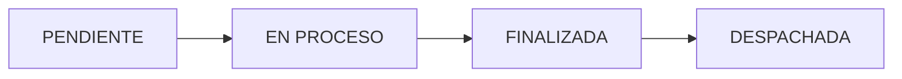

## Overview

P.FLEX provides 10+ integrated modules designed specifically for flexible packaging manufacturing. Each feature is built to handle the unique challenges of multi-stage production, complex tooling management, and real-time plant operations.

<CardGroup cols={3}>
  <Card title="Dashboard & KPIs" icon="chart-line" />
  <Card title="Work Order Management" icon="clipboard-list" />
  <Card title="Production Scheduling" icon="calendar-days" />
  <Card title="Inventory Control" icon="boxes-stacked" />
  <Card title="Quality & CAPA" icon="shield-check" />
  <Card title="Production Reports" icon="file-chart-column" />
  <Card title="User Administration" icon="users-gear" />
  <Card title="Audit Trail" icon="clock-rotate-left" />
  <Card title="Analytics" icon="chart-pie" />
  <Card title="Offline Sync" icon="cloud-arrow-down" />
</CardGroup>

## 1. Real-Time Dashboard

The control center for your entire plant operation.

### Live KPI Monitoring

```typescript src/features/dashboard/dashboard.component.ts
// Dashboard provides real-time calculated metrics
get activeProduction() {
  return this.ordersService.ots
    .filter(ot => ot.Estado_pedido === 'EN PROCESO')
    .slice(0, 5);
}

get stats() {
  const all = this.ordersService.ots;
  let totalMeters = 0;
  
  all.forEach(ot => {
    const mtl = parseFloat(String(ot.total_mtl || '0').replace(/,/g, ''));
    if (!isNaN(mtl)) totalMeters += mtl;
  });

  return {
    pending: all.filter(ot => ot.Estado_pedido === 'PENDIENTE').length,
    totalMeters: Math.round(totalMeters)
  };
}
```

**Key Metrics:**
- **OEE (Overall Equipment Effectiveness)**: Target >80%, tracks availability × performance × quality
- **Active Work Orders**: In-progress production with real-time status
- **Active Incidents**: Quality issues and machine problems requiring attention
- **Production Volume**: Total meters produced (current shift/day/month)
- **Energy Efficiency**: Power consumption relative to output
- **Sync Queue**: Offline operations pending synchronization

<Info>
  All KPIs update in real-time using Angular signals. No manual refresh required.
</Info>

### Operations Feed

Live activity stream with three filtered views:

<CardGroup cols={3}>
  <Card title="Production" icon="gears">
    Active work orders, machines running, meters produced
  </Card>
  <Card title="Alerts" icon="triangle-exclamation">
    High-priority incidents, machine failures, quality issues
  </Card>
  <Card title="Stock" icon="warehouse">
    Material arrivals, critical inventory levels, reorder alerts
  </Card>
</CardGroup>

```typescript
get feedItems() {
  const items: any[] = [];

  // 1. Production OTs
  this.ordersService.ots.forEach(ot => {
    if (ot.Estado_pedido === 'EN PROCESO') {
      items.push({
        type: 'PRODUCTION',
        title: `OT #${ot.OT} - Producción en Curso`,
        description: ot.descripcion,
        machine: ot.maquina,
        time: new Date(),
        icon: 'conveyor_belt',
        data: ot
      });
    }
  });

  // 2. Incidents
  this.qualityService.activeIncidents.forEach(inc => {
    items.push({
      type: 'ALERTS',
      title: `Incidencia: ${inc.title}`,
      description: inc.description,
      machine: inc.machineRef,
      icon: inc.priority === 'Alta' ? 'warning' : 'info',
      colorClass: inc.priority === 'Alta' ? 'text-red-400' : 'text-yellow-400'
    });
  });

  return items.sort((a, b) => b.time.getTime() - a.time.getTime());
}
```

### Quick Actions

<CardGroup cols={2}>
  <Card title="Nueva OT" icon="plus-circle">
    Create work order directly from dashboard
  </Card>
  <Card title="Importar" icon="file-import">
    Bulk upload orders from Excel
  </Card>
  <Card title="Reportar Falla" icon="circle-exclamation">
    Log incident for immediate attention
  </Card>
  <Card title="Escanear QR" icon="qr-code">
    Quick tooling or material lookup
  </Card>
</CardGroup>

### Export Capabilities

Generate reports in multiple formats:

```typescript
// Export to PDF (visual snapshot)
async exportToPdf() {
  const element = this.dashboardContent.nativeElement;
  
  const canvas = await html2canvas(element, {
    scale: 2,
    backgroundColor: '#0B0E14',
    logging: false,
    useCORS: true
  });

  const imgData = canvas.toDataURL('image/png');
  const pdf = new jsPDF('l', 'mm', 'a4');
  pdf.addImage(imgData, 'PNG', 0, 0, 297, pageHeight);
  pdf.save(`Dashboard_Report_${dateStr}.pdf`);
}

// Export to Excel (data tables)
exportToExcel() {
  const wb = XLSX.utils.book_new();
  
  // Multiple sheets: KPIs, Active Orders, Feed Activity
  XLSX.writeFile(wb, `Dashboard_Data_${dateStr}.xlsx`);
}
```

## 2. Work Order Management

Comprehensive OT (Orden de Trabajo) lifecycle management.

### OT Data Model

```typescript src/features/orders/models/orders.models.ts
export interface OT {
  OT: string;                    // Unique order number
  'Razon Social': string;        // Client name
  descripcion: string;           // Product description
  impresion?: string;            // Print specifications
  total_mtl: number | string;    // Total meters
  maquina?: string;              // Assigned machine
  Estado_pedido: 'PENDIENTE' | 'EN PROCESO' | 'FINALIZADA';
  fecha_ingreso?: string;
  fecha_entrega?: string;
  observaciones?: string;
}
```

### Create, Edit, and Delete

<Steps>
  <Step title="Manual Entry">
    Form with validation for all required fields:
    - Auto-incrementing OT numbers
    - Client search/autocomplete
    - Machine availability check
  </Step>

  <Step title="Excel Import">
    Bulk upload with intelligent column mapping:

    ```typescript src/features/orders/components/ot-import.component.ts
    // Excel import supports flexible column headers
    const COLUMN_MAPPINGS = {
      'ot': ['ot', 'orden', 'op', 'numero', 'pedido'],
      'cliente': ['razon social', 'cliente', 'client', 'customer'],
      'descripcion': ['descripcion', 'producto', 'item'],
      'metros': ['metros', 'total mtl', 'cantidad']
    };

    normalizeColumnName(raw: string): string {
      return raw.toLowerCase().trim()
        .replace(/[áàäâ]/g, 'a')
        .replace(/[éèëê]/g, 'e')
        .replace(/\s+/g, ' ');
    }
    ```
  </Step>

  <Step title="Database Search">
    Query internal database of historical orders:
    - Search by OT number, client, or product
    - Copy/clone previous orders
    - Maintain production history
  </Step>
</Steps>

### Status Workflow



Status updates trigger audit logs and notifications:

```typescript
statusColors = {
  'PENDIENTE': 'bg-yellow-500/10 text-yellow-400 border-yellow-500/20',
  'EN PROCESO': 'bg-blue-500/10 text-blue-400 border-blue-500/20',
  'FINALIZADA': 'bg-emerald-500/10 text-emerald-400 border-emerald-500/20',
  'DESPACHADA': 'bg-slate-500/10 text-slate-400 border-slate-500/20'
};
```

### OT Detail View

Click any order to see comprehensive information:
- Client and product details
- Production specifications (print colors, substrate, finishing)
- Assigned machine and operator
- Progress tracking (meters completed / total)
- Related quality incidents
- Attached files (artwork, specifications)

<Info>
  Orders in "EN PROCESO" status automatically appear in the production feed and operator assignments.
</Info>

## 3. Production Scheduling

Visual Gantt chart for time-based planning.

### Multi-Area Support

```typescript src/features/planning/schedule.component.ts
selectedArea: 'IMPRESION' | 'TROQUELADO' | 'REBOBINADO' = 'IMPRESION';

get filteredMachines() {
  let typeFilter = 'Impresión';
  if (this.selectedArea === 'TROQUELADO') typeFilter = 'Troquelado';
  if (this.selectedArea === 'REBOBINADO') typeFilter = 'Acabado';
  return this.state.adminMachines().filter(m => m.type === typeFilter);
}
```

Switch between production areas:
- **Impresión**: 9 flexographic printing presses
- **Troquelado**: 12 rotary die-cutting machines
- **Rebobinado**: 13 rewinding/finishing lines

### Shift-Based Scheduling

<CardGroup cols={2}>
  <Card title="Turno Día" icon="sun">
    07:00 - 18:00 (12-hour timeline)
  </Card>
  <Card title="Turno Noche" icon="moon">
    19:00 - 06:00 (12-hour timeline)
  </Card>
</CardGroup>

```typescript
get timeSlots() {
  return this.selectedShift === 'DIA' 
    ? ['07:00', '08:00', '09:00', '10:00', '11:00', '12:00', 
       '13:00', '14:00', '15:00', '16:00', '17:00', '18:00']
    : ['19:00', '20:00', '21:00', '22:00', '23:00', '00:00', 
       '01:00', '02:00', '03:00', '04:00', '05:00', '06:00'];
}
```

### Real-Time Machine Status

Edit machine status directly from the schedule:

```typescript
// Machine status with visual indicators
type MachineStatus = 
  | 'Operativa'      // Green - Ready for production
  | 'Mantenimiento'  // Amber - Scheduled maintenance
  | 'Detenida'       // Red - Unplanned downtime
  | 'Sin Operador';  // Gray - Waiting for operator

updateMachineStatus(machine: any, newStatus: any) {
  this.state.updateMachine({ ...machine, status: newStatus });
  // Automatically logged to audit trail
}
```

### Job Assignment

Drag-and-drop scheduling interface:

<Steps>
  <Step title="Select OT and Machine">
    Choose work order and target machine
  </Step>

  <Step title="Set Time Window">
    ```typescript
    saveJob() {
      if (this.tempStartDateTime) {
        const d = new Date(this.tempStartDateTime);
        this.currentJob.start = 
          `${d.getHours().toString().padStart(2, '0')}:${d.getMinutes().toString().padStart(2, '0')}`;
      }
      this.currentJob.duration = Math.round(this.tempDurationHours * 60);
      
      if (this.isEditing) {
        this._jobs = this._jobs.map(j => 
          j.id === this.currentJob.id ? this.currentJob : j
        );
      } else {
        this.currentJob.id = Math.random().toString(36).substr(2, 9);
        this._jobs.push(this.currentJob);
      }
    }
    ```
  </Step>

  <Step title="Validate Resources">
    Automatic checks:
    - Cliché availability in warehouse
    - Die condition (OK / Desgaste / Dañado)
    - Substrate material stock levels
  </Step>

  <Step title="Assign Operator">
    Select responsible operator from shift roster
  </Step>
</Steps>

### Visual Features

- **NOW Line**: Real-time indicator showing current time position
- **Color-coded jobs**: Different colors for different clients/priorities
- **Overlapping detection**: Warns if assignments conflict
- **Maintenance patterns**: Visual striping for non-operational machines

```typescript
// Calculate NOW line position
updateNowLine() {
  const now = new Date();
  const offset = this.getHourOffset(now.getHours(), now.getMinutes());
  if (offset >= 0 && offset <= 12) {
    this.currentLinePosition = `calc((1 - ${offset / 12}) * 16rem + ${(offset / 12) * 100}%)`;
    this.showNowLine = true;
  } else {
    this.showNowLine = false;
  }
}
```

### KPI Integration

Schedule screen includes live plant metrics:

```typescript
get kpiCriticalAlerts() {
  return this.qualityService.activeIncidents
    .filter(i => i.priority === 'Alta').length;
}

get kpiEfficiency() {
  const machines = this.state.adminMachines();
  const active = machines.filter(m => m.status === 'Operativa').length;
  return Math.round((active / machines.length) * 100);
}

get kpiPendingJobs() {
  return this.ordersService.ots
    .filter(ot => ot.Estado_pedido === 'PENDIENTE').length;
}
```

## 4. Inventory Management

Three-tier inventory system: Tooling, Materials, and Finished Goods.

### Clichés (Printing Plates)

Track thousands of printing plates with precise location mapping:

```typescript src/features/inventory/services/inventory.service.ts
export interface CliseItem {
  id: string;
  item: string;           // Unique code (e.g., "CL-1234")
  ubicacion: string;      // Rack location (e.g., "CL-1 / Nivel 2")
  descripcion: string;    // Product description
  cliente: string;        // Client name
  z: string;              // Teeth count
  ancho: number;          // Width in mm
  avance: number;         // Repeat length in mm
  col: number;            // Columns
  rep: number;            // Repeats per revolution
  n_clises: number;       // Number of plates in set
  colores: string;        // Colors (e.g., "CMYK + Barniz")
  mtl_acum: number;       // Accumulated meters
  ingreso: string;        // Entry date
  linkedDies: string[];   // Associated dies
  history: any[];         // Usage history
}
```

**Features:**
- Excel bulk import with intelligent column mapping
- Visual warehouse map with rack locations
- Search by item code, client, or dimensions
- Track accumulated wear (meters used)
- Link clichés to specific dies for complete setups

### Dies (Troqueles)

Rotary die management with condition tracking:

```typescript
export interface DieItem {
  id: string;
  serie: string;          // Die series code
  cliente: string;
  medida: string;         // Dimensions (e.g., "250mm x 300mm")
  ubicacion: string;
  z: string;              // Teeth/gear
  ancho_mm: number;
  avance_mm: number;
  columnas: number;       // Cavities/columns
  repeticiones: number;
  material: string;       // Substrate (e.g., "Polipropileno")
  forma: string;          // Shape/geometry
  estado: 'OK' | 'Desgaste' | 'Dañado' | 'Reparación';
  mtl_acum: number;
  linkedClises: string[];
}
```

**Condition Tracking:**
- **OK**: Ready for production (green badge)
- **Desgaste**: Showing wear, plan replacement (yellow)
- **Dañado**: Requires repair (red)
- **Reparación**: Currently being serviced (gray)

### Finished Goods (Stock PT)

Warehouse management for completed production:

```typescript
export interface StockItem {
  id: string;
  ot: string;             // Work order number
  client: string;
  product: string;
  quantity: number;
  unit: 'Rollos' | 'Cajas' | 'Millares';
  rolls: number;          // Number of rolls
  millares: number;       // Quantity in thousands
  location: string;       // Warehouse position (e.g., "DES-A-01")
  status: 'Liberado' | 'Cuarentena' | 'Retenido' | 'Despachado';
  entryDate: string;
  palletId: string;
  notes?: string;
}
```

**Quality Status Workflow:**
1. **Cuarentena**: Awaiting quality inspection
2. **Liberado**: Approved for shipment (green)
3. **Retenido**: Failed quality, held (red)
4. **Despachado**: Shipped to customer (gray)

### Warehouse Visualization

Interactive rack layout showing capacity:

```typescript
// Rack configuration with box ranges
readonly _layoutData = signal<RackConfig[]>([
  {
    id: 'CL1',
    name: 'RACK CL-1 (861-1190)',
    type: 'clise',
    orientation: 'vertical',
    levels: [
      {
        levelNumber: 3,
        boxes: [
          { label: '1081-1135', min: 1081, max: 1135, items: [] },
          { label: '1136-1190', min: 1136, max: 1190, items: [] }
        ]
      },
      // Additional levels...
    ]
  },
  // Additional racks...
]);

// Auto-map items to racks based on ubicacion
mapItemsToLayout() {
  const currentLayout = this.layoutData;
  const clises = this.cliseItems;
  
  clises.forEach(item => {
    const locationNumber = parseInt(item.ubicacion.replace(/\D/g, ''));
    for (const rack of currentLayout) {
      for (const level of rack.levels) {
        for (const box of level.boxes) {
          if (locationNumber >= box.min && locationNumber <= box.max) {
            box.items.push(item);
            return;
          }
        }
      }
    }
  });
}
```

<CardGroup cols={2}>
  <Card title="Heat Map View" icon="fire">
    Color-coded boxes show capacity: Green (space available), Yellow (75%+ full), Red (at capacity)
  </Card>
  <Card title="Quick Search" icon="magnifying-glass">
    Type item code to instantly highlight its location on the map
  </Card>
</CardGroup>

### Excel Import/Export

Supports flexible column headers:

```typescript
readonly CLISE_MAPPING = {
  'item': ['item', 'codigo', 'code', 'id', 'clise'],
  'ubicacion': ['ubicación', 'ubicacion', 'location'],
  'descripcion': ['descripción', 'descripcion', 'description'],
  'cliente': ['cliente', 'client'],
  'ancho': ['ancho', 'width'],
  'avance': ['avance', 'length'],
  'mtl_acum': ['mtl acum', 'mtl. acum.', 'metros acumulados']
};

normalizeData(rawData: any[], mapping: any): any[] {
  return rawData.map(row => {
    const normalized: any = {};
    for (const [targetKey, possibleHeaders] of Object.entries(mapping)) {
      for (const header of possibleHeaders as string[]) {
        if (row[header] !== undefined) {
          normalized[targetKey] = row[header];
          break;
        }
      }
    }
    return normalized;
  });
}
```

<Info>
  The import wizard shows conflicts (missing required fields) before committing, allowing you to fix data issues.
</Info>

## 5. Quality Management & CAPA

Comprehensive incident tracking with Corrective and Preventive Action system.

### Incident Reporting

```typescript src/features/quality/services/quality.service.ts
export interface Incident {
  id: string;
  code: string;                    // Auto-generated (e.g., "INC-2024-089")
  title: string;
  description: string;
  priority: 'Alta' | 'Media' | 'Baja';
  type: 'Maquinaria' | 'Material' | 'Calidad' | 'Proceso' | 'Seguridad' | 'Otro';
  status: 'Abierta' | 'Acción Correctiva' | 'Verificación' | 'Cerrada';
  otRef?: string;                  // Related work order
  machineRef?: string;             // Related machine
  reportedBy: string;
  reportedAt: Date;
  assignedTo: string;              // Department or person
  rootCause?: string;              // RCA (Root Cause Analysis)
  actions: CapaAction[];           // CAPA actions
}

export interface CapaAction {
  id: string;
  description: string;
  type: 'Correctiva' | 'Preventiva';
  responsible: string;
  deadline: string;
  completed: boolean;
}
```

### Incident Workflow

<Steps>
  <Step title="Report Incident">
    Any user can create an incident with:
    - Title and detailed description
    - Priority level (determines response time)
    - Incident type for categorization
    - Optional: Related OT and machine
  </Step>

  <Step title="Assign Responsibility">
    Route to appropriate department:
    - Mantenimiento (Maintenance)
    - Almacén (Warehouse)
    - Calidad (Quality)
    - Producción (Production)
  </Step>

  <Step title="Root Cause Analysis">
    Document findings:
    ```typescript
    rootCause: 'Fatiga de material por falta de lubricación en el turno anterior.'
    ```
  </Step>

  <Step title="CAPA Actions">
    Add corrective and preventive measures:

    ```typescript
    addCapaAction(incidentId: string, action: Partial<CapaAction>) {
      const newAction: CapaAction = {
        id: Math.random().toString(36).substr(2, 9),
        description: action.description || '',
        type: action.type || 'Correctiva',
        responsible: action.responsible || '',
        deadline: action.deadline || new Date().toISOString().split('T')[0],
        completed: false
      };
      
      // Update status to 'Acción Correctiva'
      this.audit.log(this.state.userName(), this.state.userRole(), 
        'CALIDAD', 'Agregar Acción CAPA', 
        `Acción ${newAction.type} agregada a ${incident.code}`);
    }
    ```
  </Step>

  <Step title="Track Completion">
    Monitor action progress:
    - Mark individual actions as completed
    - Verify effectiveness
    - Close incident when resolved
  </Step>
</Steps>

### Priority-Based Alerts

**Alta (High Priority):**
- Red badges throughout the system
- Appears in dashboard critical alerts KPI
- Requires immediate management attention
- Examples: Machine breakdown, safety incident, customer complaint

**Media (Medium Priority):**
- Yellow badges
- Normal workflow
- Examples: Minor quality deviation, material shortage

**Baja (Low Priority):**
- Blue badges
- Routine issues
- Examples: Process improvement suggestion, documentation update

### Metrics and Reporting

```typescript
// Quality KPIs
get activeIncidents() {
  return this.incidents.filter(i => i.status !== 'Cerrada');
}

get closedIncidents() {
  return this.incidents.filter(i => i.status === 'Cerrada');
}

get incidentsByType() {
  return {
    maquinaria: this.incidents.filter(i => i.type === 'Maquinaria').length,
    material: this.incidents.filter(i => i.type === 'Material').length,
    calidad: this.incidents.filter(i => i.type === 'Calidad').length
  };
}
```

<Info>
  All incident actions are logged to the audit trail with user, timestamp, and IP for complete traceability.
</Info>

## 6. Production Reports

Detailed reporting for print, die-cut, and finishing operations.

### Print Production Reports

```typescript src/features/production/production-print.component.ts
export interface PrintReport {
  id: string;
  date: Date;
  ot: string;
  client: string;
  product: string;
  machine: string;
  operator: string;
  shift: string;
  activities: PrintActivity[];
  totalMeters: number;
  clise: { code: string; status: string };
  die: { status: string };
  observations: string;
  productionStatus: 'PARCIAL' | 'TOTAL';
}

export interface PrintActivity {
  type: string;          // 'Setup', 'Impresión', 'Parada', etc.
  startTime: string;
  endTime: string;
  meters: number;
  duration?: string;
}
```

**Report Includes:**
- Complete time breakdown (setup, run, downtime)
- Meters produced per activity
- Tooling condition (cliché and die status)
- Operator notes and observations
- Quality checkpoints

### Activity Breakdown

```typescript
activities: [
  { type: 'Setup', startTime: '07:00', endTime: '08:30', meters: 0 },
  { type: 'Impresión', startTime: '08:30', endTime: '11:00', meters: 6000 },
  { type: 'Parada - Cambio Bobina', startTime: '11:00', endTime: '11:15', meters: 0 },
  { type: 'Impresión', startTime: '11:15', endTime: '13:00', meters: 9000 }
]
```

### Production KPIs

```typescript
get kpis() {
  const totalMeters = this.reports.reduce((acc, r) => acc + r.totalMeters, 0);
  const totalHours = this.reports.length * 6;
  const avgSpeed = (totalMeters / (totalHours * 60)) * 5; // m/min
  
  return {
    totalMeters,
    avgSpeed,
    completedOts: this.reports.filter(r => r.productionStatus === 'TOTAL').length,
    toolingIssues: this.reports.filter(r => 
      r.die.status !== 'OK' || r.clise.status !== 'OK'
    ).length
  };
}
```

<CardGroup cols={2}>
  <Card title="Total Meters" icon="ruler">
    Aggregated production volume (shift/day/month)
  </Card>
  <Card title="Average Speed" icon="gauge">
    Meters per minute across all machines
  </Card>
  <Card title="Completed Orders" icon="check">
    Number of fully completed work orders
  </Card>
  <Card title="Tooling Issues" icon="wrench">
    Clichés or dies requiring attention
  </Card>
</CardGroup>

### Tooling Status Tracking

Every report logs condition:

```typescript
getStatusClass(status: string) {
  switch(status) {
    case 'OK':
      return 'bg-emerald-500/10 text-emerald-400 border-emerald-500/20';
    case 'Desgaste':
      return 'bg-yellow-500/10 text-yellow-400 border-yellow-500/20';
    case 'Dañado':
      return 'bg-red-500/10 text-red-400 border-red-500/20';
    default:
      return 'bg-slate-500/10 text-slate-400';
  }
}
```

This feeds into predictive maintenance:
- Track accumulated meters per cliché/die
- Alert when approaching replacement thresholds
- Schedule maintenance proactively

## 7. User Administration

Role-based access control with granular permissions.

### User Roles

```typescript src/services/state.service.ts
export type UserRole = 
  | 'Jefatura'     // Management - Full access
  | 'Supervisor'   // Shift supervision
  | 'Asistente'    // Assistant/coordinator
  | 'Operario'     // Machine operator
  | 'Encargado'    // Department head
  | 'Sistemas';    // IT administrator

readonly adminRoles = signal<RoleDefinition[]>([
  {
    id: 'r1',
    name: 'Jefatura',
    description: 'Acceso total a reportes, KPIs y aprobación.',
    permissions: ['Ver Dashboard', 'Aprobar OTs', 'Reportes', 'Gestión Usuarios']
  },
  {
    id: 'r2',
    name: 'Supervisor',
    description: 'Gestión de turno y asignación.',
    permissions: ['Asignar Tareas', 'Cerrar Turno', 'Validar Calidad', 'Ver OTs']
  },
  {
    id: 'r3',
    name: 'Operario',
    description: 'Registro de producción.',
    permissions: ['Registrar Producción', 'Ver OTs']
  },
  {
    id: 'r4',
    name: 'Sistemas',
    description: 'Configuración técnica.',
    permissions: ['Admin Total']
  }
]);
```

### Permission Matrix

| Feature | Operario | Supervisor | Jefatura | Sistemas |
|---------|----------|------------|----------|---------|
| View Dashboard | Limited | ✓ | ✓ | ✓ |
| Create OTs | ✗ | ✓ | ✓ | ✓ |
| Schedule Production | ✗ | ✓ | ✓ | ✓ |
| Register Production | ✓ | ✓ | ✓ | ✓ |
| Manage Inventory | ✗ | ✓ | ✓ | ✓ |
| View Reports | Limited | ✓ | ✓ | ✓ |
| Manage Users | ✗ | ✗ | Partial | ✓ |
| System Config | ✗ | ✗ | ✗ | ✓ |

### User Management Interface

Administrators can:
- Create/edit/deactivate users
- Assign roles and permissions
- Set password policies (expiry, complexity)
- Configure auto-logout timeouts
- Manage shift assignments

```typescript
readonly config = signal<SystemConfig>({
  shiftName1: 'Turno Día',
  shiftTime1: '06:00',
  shiftName2: 'Turno Noche',
  shiftTime2: '18:00',
  passwordExpiryWarningDays: 15,
  passwordPolicyDays: 90,
  plantName: 'Planta Central - Zona Industrial',
  autoLogoutMinutes: 30
});
```

### Machine Registry

```typescript
readonly adminMachines = signal<Machine[]>([
  // IMPRESIÓN (9 machines)
  { id: 'p1', code: 'IMP-01', name: 'SUPERPRINT 1', 
    type: 'Impresión', area: 'Nave A', status: 'Operativa', active: true },
  { id: 'p2', code: 'IMP-02', name: 'SUPERPRINT 2', 
    type: 'Impresión', area: 'Nave A', status: 'Operativa', active: true },
  // ...
  
  // TROQUELADO (12 machines)
  { id: 'd1', code: 'TRQ-01', name: 'PLANA 1', 
    type: 'Troquelado', area: 'Nave C', status: 'Operativa', active: true },
  // ...
  
  // ACABADO (13 machines)
  { id: 'r1', code: 'RBB-01', name: 'REBOBINADORA 1', 
    type: 'Acabado', area: 'Nave D', status: 'Operativa', active: true },
  // ...
]);
```

<Info>
  P.FLEX tracks **34 machines** across three production areas by default. Add or modify machines through the admin interface.
</Info>

## 8. Audit Trail

Complete traceability of all system operations.

```typescript src/services/audit.service.ts
export interface AuditLog {
  id: string;
  timestamp: Date;
  user: string;
  role: string;
  module: string;        // 'ACCESO', 'OPERACIONES', 'INVENTARIO', 'CALIDAD', etc.
  action: string;        // 'Inicio de Sesión', 'Crear OT', 'Actualizar Estado', etc.
  details: string;       // Full description
  ip: string;            // Source IP address
}

@Injectable({ providedIn: 'root' })
export class AuditService {
  private _logs = signal<AuditLog[]>([]);
  
  logs = computed(() => this._logs());
  
  log(user: string, role: string, module: string, action: string, details: string) {
    const entry: AuditLog = {
      id: Math.random().toString(36).substr(2, 9),
      timestamp: new Date(),
      user,
      role,
      module,
      action,
      details,
      ip: this.getClientIP()
    };
    
    this._logs.update(logs => [entry, ...logs].slice(0, 1000)); // Keep last 1000
  }
  
  private getClientIP(): string {
    // In production, capture from request headers
    return '192.168.1.' + Math.floor(Math.random() * 255);
  }
}
```

### Logged Events

**Access Control:**
- User login/logout
- Failed authentication attempts
- Permission changes

**Operations:**
- Work order creation/modification
- Status changes
- Production scheduling
- Machine status updates

**Inventory:**
- Tooling additions/edits
- Stock movements
- Location changes

**Quality:**
- Incident reports
- CAPA actions
- Incident closure

### Audit View

```typescript src/features/audit/audit.component.ts
@Component({
  template: `
    <table>
      <thead>
        <tr>
          <th>Fecha / Hora</th>
          <th>Usuario / Rol</th>
          <th>Módulo</th>
          <th>Acción</th>
          <th>IP Origen</th>
        </tr>
      </thead>
      <tbody>
        <tr *ngFor="let log of audit.logs()">
          <td>{{ log.timestamp | date:'dd/MM/yyyy HH:mm:ss' }}</td>
          <td>
            <div>{{ log.user }}</div>
            <div class="text-xs">{{ log.role }}</div>
          </td>
          <td>
            <span class="badge">{{ log.module }}</span>
          </td>
          <td>
            <div>{{ log.action }}</div>
            <div class="text-xs">{{ log.details }}</div>
          </td>
          <td>{{ log.ip }}</td>
        </tr>
      </tbody>
    </table>
  `
})
export class AuditComponent {
  audit = inject(AuditService);
}
```

<Info>
  Audit logs are **immutable** and cannot be edited or deleted by any user, ensuring compliance and forensic capabilities.
</Info>

## 9. Analytics & Reporting

Data visualization and business intelligence.

### Report Types

<CardGroup cols={2}>
  <Card title="Production Summary" icon="chart-column">
    Daily/weekly/monthly output by machine, operator, and client
  </Card>
  <Card title="Quality Metrics" icon="shield-check">
    Incident trends, CAPA effectiveness, defect rates
  </Card>
  <Card title="OEE Analysis" icon="gauge-high">
    Availability, Performance, Quality breakdown by machine
  </Card>
  <Card title="Inventory Reports" icon="boxes">
    Stock levels, turnover rates, tooling utilization
  </Card>
</CardGroup>

### Export Formats

**PDF:**
```typescript
import jsPDF from 'jspdf';
import html2canvas from 'html2canvas';

async exportToPdf() {
  const element = document.getElementById('report-content');
  const canvas = await html2canvas(element, {
    scale: 2,
    backgroundColor: '#0B0E14'
  });
  
  const imgData = canvas.toDataURL('image/png');
  const pdf = new jsPDF('l', 'mm', 'a4');
  pdf.addImage(imgData, 'PNG', 0, 0, 297, pageHeight);
  pdf.save(`Report_${dateStr}.pdf`);
}
```

**Excel:**
```typescript
import * as XLSX from 'xlsx';

exportToExcel() {
  const wb = XLSX.utils.book_new();
  
  // Sheet 1: Summary
  const summaryData = [[...], [...]];
  const ws1 = XLSX.utils.aoa_to_sheet(summaryData);
  XLSX.utils.book_append_sheet(wb, ws1, "Resumen");
  
  // Sheet 2: Details
  const detailData = this.records.map(r => ({...}));
  const ws2 = XLSX.utils.json_to_sheet(detailData);
  XLSX.utils.book_append_sheet(wb, ws2, "Detalle");
  
  XLSX.writeFile(wb, `Report_${dateStr}.xlsx`);
}
```

## 10. Offline Sync

Resiliency for unreliable network environments.

### Architecture

```typescript
export type SyncStatus = 'online' | 'offline' | 'syncing' | 'conflict';

readonly syncStatus = signal<SyncStatus>('online');
readonly pendingSyncCount = signal<number>(0);
```

**How it works:**
1. **Local Storage**: All operations save to browser IndexedDB immediately
2. **Queue Building**: Offline changes accumulate in sync queue
3. **Auto-Sync**: When connection restores, queued operations push to server
4. **Conflict Resolution**: Detect and merge concurrent changes

### User Experience

<CardGroup cols={2}>
  <Card title="Online" icon="wifi">
    Green badge - Normal operation, real-time sync
  </Card>
  <Card title="Offline" icon="wifi-slash">
    Red badge - Working locally, queue building
  </Card>
  <Card title="Syncing" icon="arrows-rotate">
    Blue badge - Pushing queued changes to server
  </Card>
  <Card title="Conflict" icon="triangle-exclamation">
    Yellow badge - Manual intervention required
  </Card>
</CardGroup>

```typescript
setSyncStatus(status: SyncStatus) {
  this.syncStatus.set(status);
  
  // Show notification to user
  if (status === 'offline') {
    this.showToast('Sin conexión - Los datos se guardarán localmente');
  } else if (status === 'online') {
    this.showToast('Conexión restaurada - Sincronizando...');
    this.triggerSync();
  }
}
```

<Note>
  The sync queue is visible in the dashboard KPI panel, showing how many operations are pending upload.
</Note>

## Summary

P.FLEX integrates all aspects of flexible packaging manufacturing into a unified, real-time system:

<CardGroup cols={2}>
  <Card title="For Operators" icon="user-gear">
    Simple interface to register production, report issues, and view assignments without complexity
  </Card>
  <Card title="For Supervisors" icon="clipboard-check">
    Full visibility into plant status with tools to schedule, validate, and respond to incidents
  </Card>
  <Card title="For Management" icon="chart-line">
    Real-time KPIs, analytics, and reporting to drive strategic decisions
  </Card>
  <Card title="For IT/Systems" icon="server">
    Robust configuration, user management, and audit capabilities for compliance
  </Card>
</CardGroup>

## Next Steps

<CardGroup cols={3}>
  <Card title="Quick Start" icon="rocket" href="/quickstart">
    Install and configure P.FLEX
  </Card>
  <Card title="API Reference" icon="code" href="/api">
    Integrate with external systems
  </Card>
  <Card title="Best Practices" icon="star" href="/guides">
    Optimization tips and workflows
  </Card>
</CardGroup>